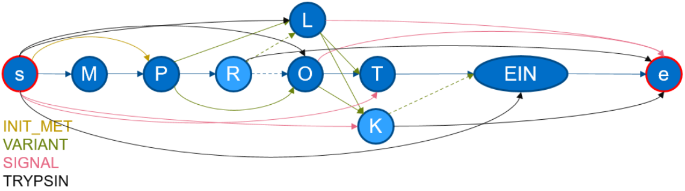

# [WIP] ProtGraph - A Graph-Generator for Proteins

This project aims to efficiently generate graphs of proteins using text entries from [UniProt](https://www.uniprot.org/). These files either end via: `.dat` or `.txt`.

We utilize the Framework: [BioPython](https://biopython.org/) and [igraph](https://igraph.org/python/) to generate so called directed and acyclic graphs (DAGs) of proteins

In essence, this tool is doing the following:

Lets assume that an entry has been saved from UniProt, containing following information:

```txt
ID   MY_CUSTOM_PROTEIN             Reviewed;         8 AA.
AC   QXXXXX

...

FT   INIT_MET        1
FT                   /note="Removed"
FT                   /evidence="EXAMPLE Initiator Metheonine"
FT   SIGNAL          1..4
FT                   /evidence="EXAMPLE Signal"
FT   VARIANT         3
FT                   /note="Missing (in Example)"
FT                   /evidence="EXAMPLE Variant 1"
FT                   /id="VAR_XXXXX1"
FT   VARIANT         4
FT                   /note="O -> L (in Example)"
FT                   /evidence="EXAMPLE Variant 2"
FT                   /id="VAR_XXXXX2"
FT   VARIANT         5
FT                   /note="L -> K (in Example)"
FT                   /evidence="EXAMPLE Variant 3"
FT                   /id="VAR_XXXXX3"
SQ   SEQUENCE   8 AA;  988 MW;  XXXXXXXXXXXXXXXX CRC64;
     MPROTEIN                   
```

This entry contains the canonical sequence (in section `SQ`), which is used usually in fasta files and other tools. But this entry provides further information, which are usually not considered and left out. Especially in this example, a `SIGNAL` peptide is present, leading to a peptide, which may not be covered when cleaving e.g. via Trypsin. Additionally 3 `VARIANT`s are present in this entry, informing about substituted aminoacids, which again may yield peptides that are not covered by the canonical sequence or by digestion.

With `ProtGraph`, a graph can be generated. It may look as follows:


With this graph, the earlier mentioned peptides are now considered and could be retrieved, by traversing from the dedicated `s`tart node to the dedicated `e`nd node. (These are internally denoted by: `__start__` and `__end__`). The `black drawn` edges (with the label `TRYPSIN`) indicate that this graph was additionally digested via Trypsin (default) leading to a compact DAGraph, allowing to compute all possible peptides and even more statistics!

This tool will additionally generate a statistics file when generating a graph from an UniProt-entry, containing various information about the protein/entry which were retrieved during generation (partially on the fly).

If executing via the flag `-cnp`, the number of possible paths between `s` and `e` are calculated. In this example, `48` paths are possible. With this, we now know that there are `48` peptides (some of them repeating) in such a (small) graph. It may be interesting to know how many (repeating) peptides with a certain number of miscleavages are present in a protein. To calculate this statistic, simply provide the flag `-cnpm`. In this example: `25` peptides with 0 miscleavages, `19` with 1 miscleavage and `4` with 2 miscleavages are present.

By combining the flags `-cnph` and `-nm`, the distribution of the peptide lengths (counting aminoacids) over all possible peptides can be retrieved. For the example protein, we retrieved the following distribution:
| Peptide Length | 1 | 2 | 3 | 4 | 5 | 6 | 7 | 8 |
|----------------|---|---|---|---|---|---|---|---|
| #Peptides      | 3 | 6 | 9 | 8 | 6 | 4 | 8 | 4 |

## Setting up

To set up `ProtGraph` make sure you have `pipenv` and `pyenv` installed. (via `pacman` `apt` and alike)

First clone this project and enter its directory via:

```shell
git clone git@github.com:mpc-bioinformatics/provar-db-graph-gen.git
cd provar-db-graph-gen
```

Now the dependencies (and possibly Python) need to be installed. This can be done with:
> pipenv install

After everything is set up activate the environment via:
> pipenv shell

That is everything, that needed to be done. You can now convert Uniprot-entries into graphs!

## Usage

Currently, the entrypoint of this project is `main.py`. However, this may change in future.

To see an overview of possible parameters and options use: `python main.py --help`. The `help`-output contains brief descriptions for each flag.

### Example calls

Lets use the internal example from `e_coli.dat` located in `examples/e_coli.dat` (Or any other `.txt` or `.dat` file).

The graph generation can be executed via: `python main.py examples/e_coli.txt`. This will generate graphs and the additional statistics file. After it has finished (should only take up to 3 minutes), you can inspect the statistics file.

---

But why does it not show information when it will end?

Sadly, `Biopython` does not provide information of how many entries are available in a `.txt` or `.dat` file. Therefor this information needs to be provided via another parameter: `python main.py --num_of_entries 9434 e_coli.txt` (you can also use `-n`). To retrieve the number of entries beforehand you could e.g. use a simple command as follows `cat /examples/e_coli.dat | grep "^//" | wc -l`. It is also possible to add multiple files. The number of entries for each file then need to be summed: `python main.py -n 18868 examples/e_coli.txt examples/e_coli.txt`

---

If to many (or to few) processes are executed, then it can be adjusted via `--num_of_processes` or `-np`. E.G. `python main.py --num_of_processes 3 --num_of_entries 9434 examples/e_coli.txt` will use 4 (`3` + 1 reading process) processes.

---

To fully annotate the graphs with weights, use the following: `python main.py -amwe -aawe -cnp -cnpm -cnph -n 9434 examples/e_coli.dat`

## Exporting graphs

But where are the graphs after executing this tool?

The default behaviour of `ProtGraph` is to exclude the generated graphs, since those can explode in size and disk space may be limited. Currently a few export functionalities are available and it is planned to extend this functionality.

### File Exports

To export each protein graph into a folder, simply set the flags `-edot`, `-egraphml` and/or `-egml`, which will create the corresponding dot, GraphML or GML files into a output folder. Exporting to GraphML is recommended since this is the only export method able to serialize all properties in a file which have been set in this project on a graph.

### Database Exporters

The database exporters are currently under development. But currently two different exports are available. `ProtGraph` allows to export the generated graphs into PostgreSQL as well as into RedisGraph. For configuration such export, please look into the `--help` output.

Note: In Postgresql a database should be created where the tables `nodes` and `edges` are NOT present.

Note: For RedisGraph, a version with a custom set `YY_BUFFER_SIZE` buffer length needs to be compiled manually. This is due to some issues regarding the buffer length in Redisgraph.

## Missing Functionalities

* Other Export functionalities!
